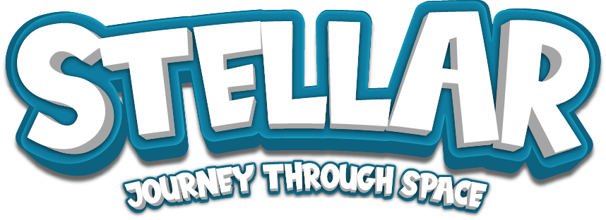

# Stellar Application Implementation

## Overview

This repository contains the implementation code for the Stellar Application, an educational augmented reality (AR) application designed to enhance astronomy education for Generation Alpha students. Based on extensive research, the application combines functional and non-functional requirements aimed at providing an engaging and interactive learning experience.

## Project Domain Overview

The Stellar Application is developed to make learning astronomy concepts engaging and interactive through the use of AR technology. A rich picture illustrating the domain overview and an onion diagram detailing stakeholder interactions are included to provide insight into the project's context and the collaborative nature of its development.

## Requirements Analysis

### Gathered Requirements

Both functional and non-functional requirements have been extensively gathered and analyzed to ensure the application meets educational goals and user expectations. This analysis is foundational to the development and functionality of the Stellar Application.

### Functional Requirements

- Interactive AR experiences to explore astronomy concepts
- Gamification elements (badges, stars) to motivate learners
- User progress tracking

### Non-Functional Requirements

- Cross-platform compatibility (iOS and Android)
- Intuitive and user-friendly interface
- High performance with minimal lag

## Implementation Details

The implementation chapter documents the step-by-step process of bringing the Stellar Application from concept to reality, addressing technical challenges and ensuring the application's alignment with the identified requirements.

## Running the Application

Instructions for setting up and running the Stellar Application on various devices are provided, ensuring users can easily access and navigate the application.

## Contributing

Contributions to the Stellar Application are welcome. Please refer to the contribution guidelines for more information on how to submit issues, propose changes, and contribute to the codebase.

## License

The Stellar Application is released under MIT License, which details the permissions, limitations, and conditions under which the software can be used, modified, and distributed.

## Acknowledgments

Acknowledgments to all stakeholders involved in the research and development of the Stellar Application, including educational experts, developers, and the Generation Alpha students who provided invaluable feedback.

---
